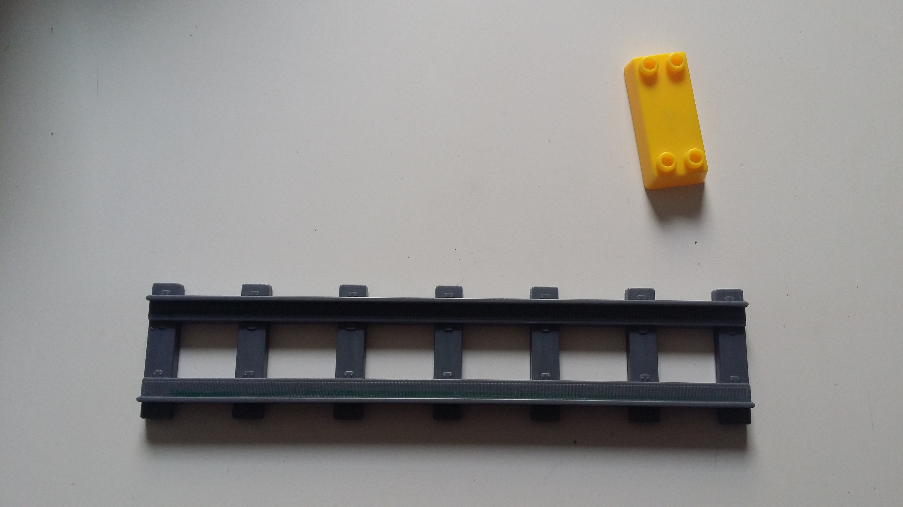

# Train

l'idée est de commencer par reproduire les rails et les jonctions. Pour le train on verra un jour :)

## logiciel

j'utilise openscad : http://www.openscad.org/documentation.html

## jonction

Comme le montre la photo les rails sont reliés par un hexahedre ayant la base plus large que la surface. Je me suis contenté de faire un cube :)
J'ai également fait deux attaches circulaire et deux attaches angulaire pour...Le fun? :)

## rails

Je n'ai pas pu m'empecher de le faire :p C'est amusant mais il va falloir mieux organiser tt cela. Le rail dépasse la taille de l'imprimante 3D, je vais faire un template pour pouvoir regler la taille à loirsir :)

## a faire

Le schema. Je l'ai fait sur papier mais je suis tellement mauvais en dessin technique que je préfère le cacher, je chercherais un logiciel qui permet de presenter qq chose de propre.

  NB : Je n'exagere pas je l'ai fait au crayon HB mal taillé.
